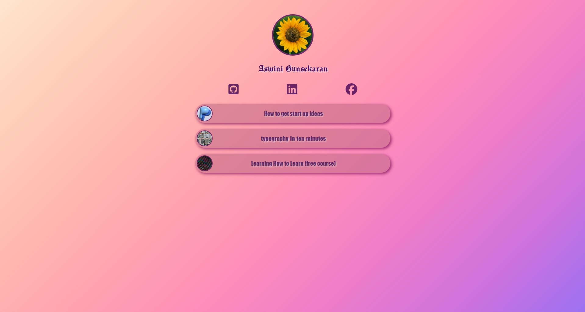

# Link-in-Bio Web Page

This is a simple and elegant **"Link in Bio"** personal webpage made using **HTML** and **CSS**, inspired by platforms like Linktree.  
It includes profile information, social media icons, and links to useful resources.

## Live Demo

View it on Render https://link-in-bio-sz2s.onrender.com or github repo https://github.com/AswiniVelavan/link-in-bio

##  Screenshots

## Features
Responsive layout
Profile image and name
Social media icons with links
Link cards with thumbnails and descriptions

## How to Use
Open the index.html file in any web browser.
Click on the social media icons to visit your GitHub, LinkedIn, or Facebook.
Click on any button link to open the external resources (e.g., articles or courses).

## Author
Aswini Gunasekaran
